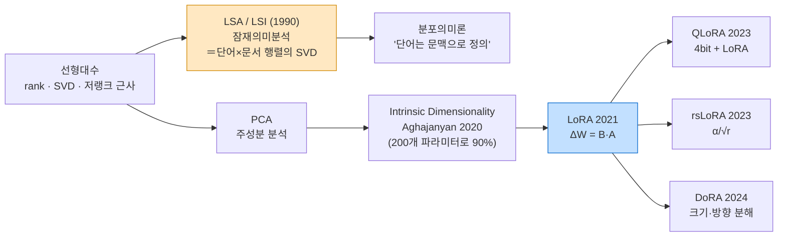
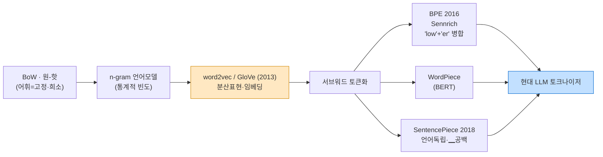
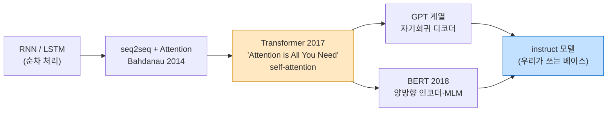
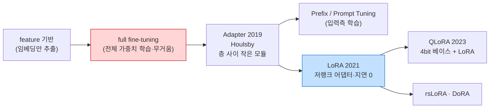
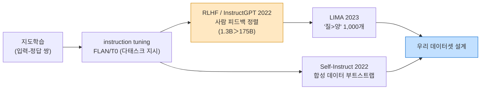
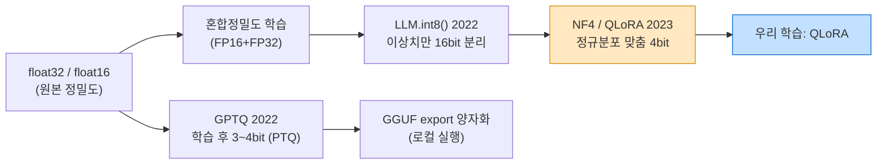

# 07. 계보 지도 (Lineage Map) — 개념이 어디서 왔나

이 프로젝트의 각 개념이 **자연어정보분석(NLP)의 어떤 알고리즘·성장 계열**에서 흘러왔는지
한 장으로 잇는 지도입니다. 강의에서 배운 고전(행렬분해·LSA·분포의미론·n-gram)이 어떻게
오늘의 **LoRA·QLoRA·파인튜닝**으로 이어지는지 보여 줍니다.

> 다이어그램은 GitHub에서 자동 렌더링됩니다(Mermaid). 각 위키 페이지가 **어느 줄기에 매달려
> 있는지**를 표시했습니다.
>
> 🖼️ **슬라이드·인쇄용 고해상도 PNG**는 [`diagrams/`](diagrams/) 갤러리에 있습니다(6장).

---

## 🗺️ 전체 한눈에 — 6대 계보와 위키 매핑

| 계보(줄기) | 고전 뿌리 (강의 토대) | 현대 가지 (이 프로젝트) | 해당 위키 |
|---|---|---|---|
| ① 저차원·행렬분해 | rank·SVD·PCA → **LSA** | intrinsic dim → **LoRA→rsLoRA/DoRA** | [01](01-core-concepts.md)·[02](02-hyperparameters.md) |
| ② 표현·토큰화 | BoW·n-gram → **word2vec/GloVe** | **BPE·SentencePiece** → subword | [03](03-dataset-design.md) |
| ③ 아키텍처·사전학습 | RNN/LSTM → seq2seq+attention | **Transformer → BERT/GPT** | (베이스 모델) |
| ④ 전이학습·PEFT | feature 기반 → full fine-tune | adapter → **LoRA/QLoRA(PEFT)** | [01](01-core-concepts.md)·[04](04-unsloth-studio-workflow.md) |
| ⑤ 정렬·데이터 | 지도학습 → instruction tuning | RLHF → **LIMA/Self-Instruct** | [03](03-dataset-design.md) |
| ⑥ 효율·양자화 | float32 → 혼합정밀도 | PTQ(GPTQ)·**LLM.int8→NF4(QLoRA)** | [01](01-core-concepts.md) |

---

## ① 저차원·행렬분해 계보 — *rank가 LSA를 거쳐 LoRA가 되기까지*

> 위키 [01 rank·LoRA](01-core-concepts.md) · [02 alpha·rank](02-hyperparameters.md).
> **핵심 메시지: "큰 행렬은 적은 자유도로 충분하다"는 한 가지 직관이 1990년대 LSA부터
> 2021년 LoRA까지 관통한다.** 실습 [`01_rank_and_lora.py`](../tutorial/01_rank_and_lora.py)가 이 줄기 전체를 압축.

**연결 고리**: LSA는 *단어×문서 행렬을 SVD로 저랭크 근사*해 의미를 뽑는다 → LoRA는 *가중치 변화량
ΔW를 저랭크로 근사*해 학습한다. **둘 다 "행렬의 본질 rank는 작다"는 같은 가정**.
자연어정보분석에서 LSA를 배웠다면, LoRA는 그 직관을 신경망 가중치에 적용한 것일 뿐입니다.

---

## ② 표현·토큰화 계보 — *글자를 숫자로 바꾸는 방법의 진화*

> 위키 [03 데이터셋·토큰화](03-dataset-design.md). 실습 [`03_tokenization_and_dataset.py`](../tutorial/03_tokenization_and_dataset.py).

**연결 고리**: 고정 어휘(BoW)는 희귀어·신조어에서 무너진다 → 분포의미론(word2vec)이 "단어=벡터"를
주고 → **서브워드(BPE)** 가 "어휘를 조각으로 쪼개 무한 단어를 유한 토큰으로" 해결. 파인튜닝 데이터가
**왜 chat template·토큰화 형식에 맞아야 하는지**가 이 줄기의 끝.

---

## ③ 아키텍처·사전학습 계보 — *베이스 모델은 어디서 왔나*

> "자신의 베이스 모델을 잡는다"([04 워크플로우](04-unsloth-studio-workflow.md) ①)의 배경.

**연결 고리**: Transformer의 q·k·v·o(attention)와 gate·up·down(MLP) 프로젝션이 바로
[02 target modules](02-hyperparameters.md)에서 **LoRA를 붙이는 그 부품들**입니다.

---

## ④ 전이학습·PEFT 계보 — *파인튜닝이 가벼워진 길*

> 위키 [01 LoRA/QLoRA](01-core-concepts.md) · [04 학습 단계](04-unsloth-studio-workflow.md).
> PEFT = Parameter-Efficient Fine-Tuning.

**연결 고리**: full fine-tuning은 175B면 175B 전부를 저장·학습(현실적으로 불가) → adapter가 "작은
모듈만" 아이디어를 열고 → **LoRA**가 추론 지연 없이(병합 가능) 그 자리를 차지 → **QLoRA**가 메모리
장벽까지 무너뜨려 학생용 GPU에 도달. 이 줄기의 끝이 곧 이번 과제의 방법 선택([01](01-core-concepts.md)).

---

## ⑤ 정렬·데이터 계보 — *무엇을·얼마나 가르치나*

> 위키 [03 데이터셋 설계](03-dataset-design.md).

**연결 고리**: "데이터 형식(role·chat template)"과 "데이터 품질(질>양)"이라는 [03](03-dataset-design.md)의
두 기둥이 각각 instruction tuning과 LIMA에서 나옵니다. 데이터가 없으면 Self-Instruct(=Data Recipes).

---

## ⑥ 효율·양자화 계보 — *비트를 줄여 GPU에 욱여넣기*

> 위키 [01 양자화·QLoRA](01-core-concepts.md). 실습 [`02_quantization.py`](../tutorial/02_quantization.py).

**연결 고리**: 학습 시 메모리 절약은 **NF4(QLoRA)** 줄기([04](04-unsloth-studio-workflow.md) ④),
배포 시 용량 절약은 **GPTQ→GGUF** 줄기([04](04-unsloth-studio-workflow.md) ⑥). 실습 2-(c)의
분위수 눈금이 NF4의 핵심.

---

## 🔗 통합 색인 — 위키 ↔ 계보 ↔ 논문 ↔ 실습

| 위키 페이지 | 매달린 계보 | 대표 논문(번호는 [05](05-resources.md)) | 실습 |
|---|---|---|---|
| [01 core-concepts](01-core-concepts.md) | ① 행렬분해 · ④ PEFT · ⑥ 양자화 | LoRA·Aghajanyan·QLoRA·LLM.int8·GPTQ (1–5) | 01, 02 |
| [02 hyperparameters](02-hyperparameters.md) | ① 행렬분해(rank·α) · ③ 아키텍처(target) | LoRA·rsLoRA·DoRA (1,6,7) | 01 |
| [03 dataset-design](03-dataset-design.md) | ② 토큰화 · ⑤ 정렬·데이터 | LIMA·InstructGPT·Self-Instruct·BPE·SP (8–12) | 03 |
| [04 workflow](04-unsloth-studio-workflow.md) | ③ 아키텍처 · ④ PEFT · ⑥ 양자화 | (단계별 매핑 표) | 전체 |

---

## 한 문장 계보 요약

> **자연어정보분석의 고전 두 축 — `행렬을 저랭크로 근사`(LSA)와 `단어를 분산표현으로`(word2vec) — 가
> 각각 LoRA(①④)와 토큰화(②)로 이어지고, 여기에 Transformer(③)·정렬데이터(⑤)·양자화(⑥)가 합쳐진
> 지점이 바로 이번 Unsloth 파인튜닝 프로젝트다.**

전체 길잡이는 [`00-overview.md`](00-overview.md), 논문 색인은 [`05-resources.md`](05-resources.md).
