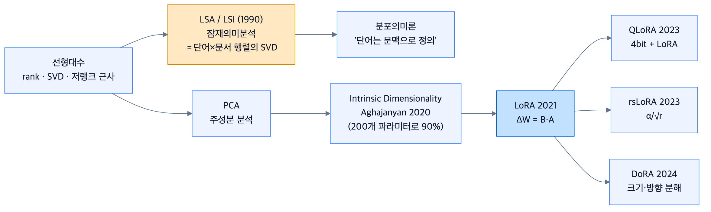
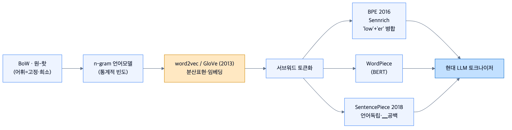
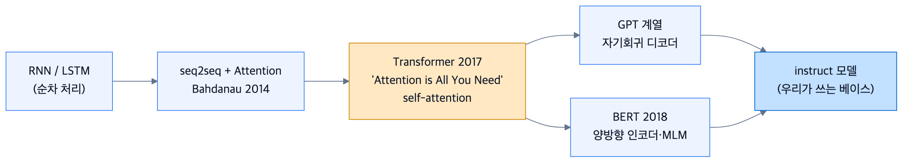
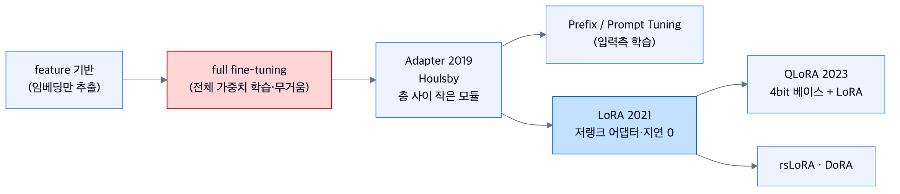
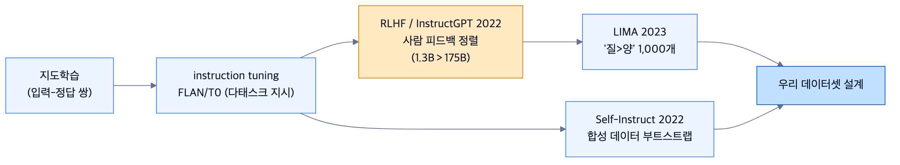
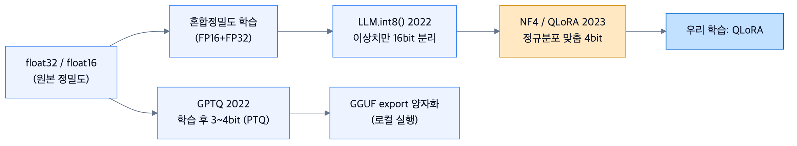

# 계보 다이어그램 — PNG 갤러리 (슬라이드용)

[`07-lineage-map.md`](../07-lineage-map.md)의 6대 계보를 **고해상도 PNG**(scale 3×, 흰 배경)로
렌더링한 것입니다. 강의 슬라이드·인쇄물에 바로 붙여 쓰세요.

> 재생성: `wiki/diagrams/`에서 아래 한 줄.
> ```bash
> for f in src/*.mmd; do mmdc -i "$f" -o "$(basename "$f" .mmd).png" \
>   -c mermaid-config.json -C style.css -p puppeteer.json -b white -s 3; done
> ```
> (필요 도구: `npm i -g @mermaid-js/mermaid-cli`. 한글 폰트는 Apple SD Gothic Neo 사용.)

---

## ① 저차원·행렬분해 — LSA에서 LoRA까지


## ② 표현·토큰화 — BoW에서 서브워드까지


## ③ 아키텍처·사전학습 — RNN에서 instruct 모델까지


## ④ 전이학습·PEFT — full fine-tune에서 QLoRA까지


## ⑤ 정렬·데이터 — 지도학습에서 LIMA까지


## ⑥ 효율·양자화 — float32에서 NF4까지


---

원본 Mermaid 소스는 [`src/`](src/), 설명·연결 고리는 [`../07-lineage-map.md`](../07-lineage-map.md).
